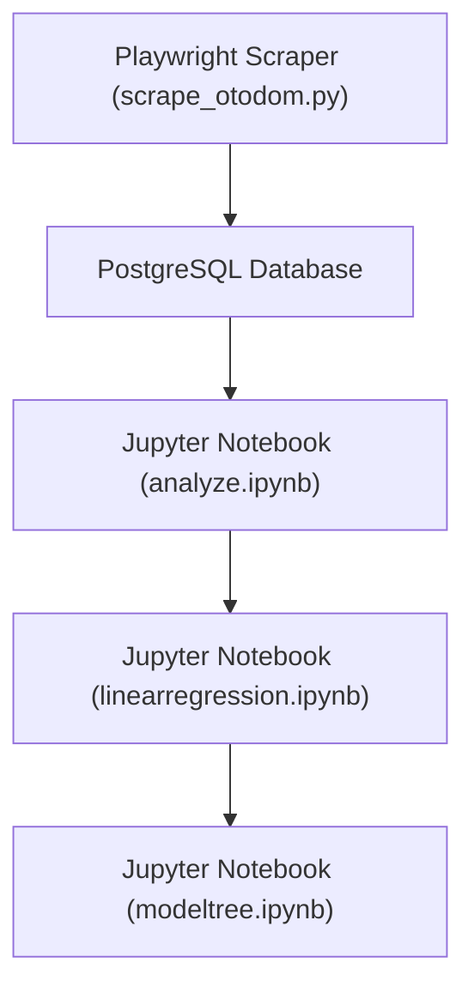

# Otodom Apartments for Sale – Data Analysis (Q3 2025)


A **data-driven study of Poznań’s apartment market (Q3 2025)**  
focusing on **price per m²**, **district**, **distance to city centre**, **room count**, and **seller type**.

The project includes a **web-scraper → database pipeline → analysis workflow** with:
- Python + Playwright scraper  
- PostgreSQL ETL pipeline  
- District-level EDA, visualization 
- Linear regression (OLS & WLS)
- Models evaluation & residual diagnostics
- Tree based model with XGBoost

---


## Project Overview
I scrape apartment listings from [Otodom.pl](https://www.otodom.pl/pl/wyniki/sprzedaz/mieszkanie/wielkopolskie/poznan/poznan/poznan), store them in **PostgreSQL**, and analyze pricing determinants to uncover **spatial & seller-driven pricing patterns**.

---

## Data Pipeline


1. **Scraper:** collects ~10 pages of Poznań listings, expands developer group listings  
2. **Database Layer:** SQLAlchemy → PostgreSQL container  
3. **Analysis:** cleaning, `price_per_sqm` feature, district & seller-type EDA, regression  
4. **Containerized:** `docker-compose` orchestrates DB, scraper, Jupyter with `wait-for-it.sh`

---

## Project Structure
```
├── scrape_otodom.py        # Playwright scraper
├── db.py                    # DB helpers (SQLAlchemy)
├── analyze.ipynb            # Cleaning, visualization, basic statistical analysis
├── modeltree.ipynb            # XGBoost regression
├── linearregression.ipynb      # Linear regression
├── docker-compose.yml
├── requirements.txt
├── output/                  # csv with data used in the analysis
├── README.md
└── .env / .gitignore / wait-for-it.sh …
```

## Key Insights – Q3 2025
> *All numbers based on n pages of Poznań listings scraped in August 2025*

### 1️ Price per Square Meter
- **Average:** ≈ **12,229.79 PLN/m²** (median ≈ **12,264.15 PLN/m²**)  
- **District variation:**  
  - **Stare Miasto:** highest average ≈ **14,471.59 PLN/m²**  
  - **Nowe Miasto:** most affordable ≈ **10,424.79 PLN/m²**  
- **Seller type influence:**  
  - Private listings tend to have higher price per m² (median ~12,356 PLN/m²) than agency listings (~11,981 PLN/m²)  
  - Developer listings are limited in number; statistics are not representative  

### 2️ Apartment Size
- **Average area:** ≈ **55.14 m²** (median ≈ **52.1 m²**)  
- **District patterns:**  
  - Central districts (**Stare Miasto**, **Wilda**) have smaller apartments  
  - **Grunwald** and **Jeżyce** feature larger units  
- **Number of rooms:**  
  - Average ~2.45 rooms (median 2 rooms)  
  - Grunwald and Nowe Miasto tend to have slightly more rooms  
  - Stare Miasto and Wilda lean toward smaller layouts (1–2 rooms)  

### 3️ Listings by Seller Type
- **Agencies dominate** most districts:  
  - Nowe Miasto (~93% agency listings)  
  - Jeżyce (~90% agency listings)  
- **Stare Miasto:** more balanced mix, ~11% developer listings (note: many missing price data)  
- **Wilda** and **Grunwald:** significant proportion of private offers, particularly Wilda (~49%)  

### 4️ Market Coverage & Data Completeness
- **Total listings:** 900  
  - Price available: 722/900  
  - Rooms & area available: 898/900  
  - Seller type available: 695/900  
- Despite missing prices in some listings, the dataset provides a **reliable overview** of apartment sizes, pricing, and seller distribution  

---

## Analysis Highlights
- **Feature Engineering:**  
  - `price_per_sqm`  
  - `distance_km` from city center (based on district mapping)  
- **Descriptive Statistics:**  
  - District-level analysis: price, price per m², rooms, area, skewness, kurtosis  
  - Seller type analysis: price, price per m², rooms, area, counts  
- **Regression Models:**  
  - **OLS** on log(price) using `area`, `rooms`, `distance_km`, and district dummies  
  - **Weighted Least Squares (WLS)** to handle heteroskedasticity  
  - **XGBoost Tree-Based Model** with cross-validation:  
    - **Best number of boosting rounds:** 146  
    - **Train RMSE (mean):** 26,257.15  
    - **Test RMSE (mean):** 65,574.50  
    - **R² Score (test set):** 0.881  
    - **MSE (test set):** 4,210,185,050.24  
    - **Model parameters:**  
      ```python
      {'objective': 'reg:squarederror', 'colsample_bytree': 0.3, 'learning_rate': 0.1,
       'max_depth': 5, 'n_estimators': 146, 'random_state': 49, 'alpha': 10}
      ```

- **Diagnostics & Model Assessment:**  
  - R², RMSE  
  - Residual vs predicted plots  
  - Residual distribution checks  

---

## Example Visuals

| |
|-|
|
|
|

| |

---

## Key Regression Insights (OLS & WLS & XGBOOST)

I fitted 3 main models to understand price determinants:

| Model       | Dependent Variable | R²    | Key Notes |
|------------|------------------|-------|-----------|
| **OLS**    | `price` (PLN)    | 0.82  | Captures ~82% of price variation; good overall fit. |
| **WLS**    | `log_price`      | 0.95  | Better fit after log-transforming price and applying WLS to handle heteroskedasticity. |
| **XGBoost**| `price` (PLN)    | 0.88  | Tree-based model captures nonlinearities and interactions automatically; strong predictive performance on original price scale (MSE ≈ 4.21e9 PLN²). |

---

---

## Tools & Skills
- **Python 3.11** – Playwright, BeautifulSoup, Pandas, NumPy, Matplotlib, Seaborn  
- **Statsmodels & scikit-learn** – OLS, WLS, multicollinearity, RESET tests  
- **PostgreSQL + SQLAlchemy** – data storage & ETL  
- **Docker & docker-compose** – containerized pipeline  
- **Jupyter Notebook** – analysis & reporting

---

## License
MIT License – see [LICENSE](LICENSE).

---

## Contact
 **s.abilinska@gmail.com**  
 [LinkedIn – Natalia Bilińska](https://www.linkedin.com/in/natalia-bilińska-8874a3359)

 LinkedIn: [www.linkedin.com/in/natalia-bilińska-8874a3359](https://www.linkedin.com/in/natalia-bilińska-8874a3359)

