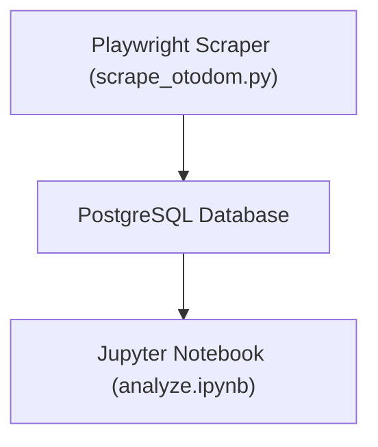

# Otodom Apartaments for Sale Data Analysis - Q3 2025

A comprehensive analysis of apartment pricing in **Poznań (Q3 2025)**, considering **price per m², room count, district, and seller type**.  
The project includes a **web scraper**, **database pipeline**, and a **data analysis workflow** with regression models and visualization.

---

## Overview

This project aims to capture and analyze the **Poznań housing market** as listed on [Otodom.pl](https://www.otodom.pl/pl/wyniki/sprzedaz/mieszkanie/wielkopolskie/poznan/poznan/poznan).  

The pipeline:
1. **Scrapes apartment listings** from Otodom, including both individual and **developer group listings**.
2. **Stores** all data in a **PostgreSQL** database.
3. Performs **data cleaning, exploration, visualization, and regression analysis** in a Jupyter Notebook.
4. Outputs insights about **price determinants** such as district, area, seller type, and room count.

> **Data source:** [Otodom – Poznań apartments for sale](https://www.otodom.pl/pl/wyniki/sprzedaz/mieszkanie/wielkopolskie/poznan/poznan/poznan)

---

## Data Pipeline

### Steps:
1. **Scraping (scrape_otodom.py)**  
   - Collects 10 pages of listings for Poznań.
   - Detects **group listings** and follows “See all listings” links.
   - Extracts: `district`, `price`, `area (m²)`, `rooms`, `seller_type`.  
   - Stores all records in PostgreSQL.

2. **Database Layer (db.py)**  
   - SQLAlchemy-based connection to a PostgreSQL container.
   - Handles table creation and record insertion.

3. **Analysis (analyze.ipynb)**  
   - Connects to the database.
   - Performs data cleaning, exploratory visualizations, and regression modeling.
   - Outputs insights such as price/m² trends by district and seller type.

4. **Containerized Environment (docker-compose.yml)**  
   - Spins up:
     - **PostgreSQL** (database)
     - **Scraper** (Python + Playwright)
     - **Jupyter Notebook** (for EDA and modeling)
   - Ensures services start in correct order using `wait-for-it.sh`.

---

## Files

| File / Folder           | Description                                                        |
|-------------------------|--------------------------------------------------------------------|
| `.env`                  | Environment variables (DB credentials and configs)                 |
| `.gitignore`            | Git ignore rules                                                   |
| `Dockerfile`            | Builds the scraper container environment                           |
| `docker-compose.yml`    | Orchestrates scraper, database, and Jupyter containers             |
| `wait-for-it.sh`        | Wait script to ensure DB is ready before scraper runs              |
| `scrape_otodom.py`      | **Playwright web scraper** for Otodom listings                     |
| `db.py`                 | Database connection & helper functions using SQLAlchemy            |
| `analyze.ipynb`         | Main notebook for **data cleaning, visualization, and regression** |
| `requirements.txt`      | Python dependencies for scraper and analysis                       |
| `output.csv`            | Optional CSV export of scraped data                                |
| `README.md`             | This documentation                                                 |
| `.ipynb_checkpoints/`   | Auto-generated Jupyter checkpoint files                            |
| `__pycache__/`          | Python bytecode cache                                              |

---

## Tools & Skills

- **Python 3.11**
  - Playwright & BeautifulSoup (web scraping)
  - Pandas, NumPy (data processing)
  - Matplotlib, Seaborn (visualizations)
  - Scikit-learn, Statsmodels (regression modeling & diagnostics)
- **PostgreSQL** (data storage)
- **SQLAlchemy** (Python–DB interface)
- **Docker & docker-compose** (for containerized pipeline)
- **Jupyter Notebook** (analysis and reporting)
- **Modeling skills**: regression, multicollinearity & RESET tests
- **Data engineering**: ETL pipeline, database integration

---

## Example Output

### Visualizations:
- Price per m² distribution (bar chart)
- Seller type distribution across districts
- Predicted vs Actual Price
- Residuals vs Predicted price
- Residuals Distribution
- Residuals vs Predicted log-Price (Weighted Least Squares)
- Alternative Residual Plot

## Contact

📧 E-mail: **s.abilinska@gmail.com**  
💼 LinkedIn: [www.linkedin.com/in/natalia-bilińska-8874a3359](https://www.linkedin.com/in/natalia-bilińska-8874a3359)

