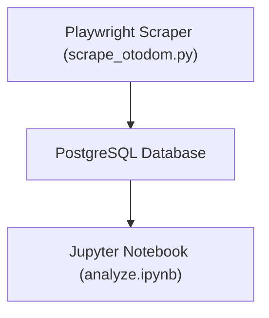

# Otodom Apartments for Sale – Data Analysis (Q3 2025)


A **data-driven study of Poznań’s apartment market (Q3 2025)**  
focusing on **price per m²**, **district**, **distance to city centre**, **room count**, and **seller type**.

The project includes a **web-scraper → database pipeline → analysis workflow** with:
- Python + Playwright scraper  
- PostgreSQL ETL pipeline  
- District-level EDA, visualization & regression (OLS & WLS)  
- Model evaluation & residual diagnostics

---

## Key Insights – Q3 2025
> *All numbers based on ~10 pages of Poznań listings scraped in August 2025*

- **Average price per square meter:** ≈ **12,229.79 PLN/m²** (median ≈ **12,264.15 PLN/m²**)  
  - Prices are relatively consistent across districts, but **Stare Miasto** commands the highest average at **≈14,471.59 PLN/m²**, while **Nowe Miasto** is the most affordable at **≈10,424.79 PLN/m²**.  

- **Average apartment size:** ≈ **55.14 m²** (median ≈ **52.1 m²**)  
  - Central districts like **Stare Miasto** and **Wilda** tend to have smaller apartments, while **Grunwald** and **Jeżyce** feature larger units.  

- **Average number of rooms:** ≈ **2.45 rooms** (median **2 rooms**)  
  - Apartments in **Nowe Miasto** and **Grunwald** generally have slightly more rooms, whereas **Stare Miasto** and **Wilda** lean toward smaller, 1–2 room layouts.  

- **Listings by seller type:**  
  - Most districts rely heavily on **real estate agencies**, especially **Nowe Miasto** (93%) and **Jeżyce** (≈90%).  
  - **Stare Miasto** has a more balanced mix, including ~11% from developers.  
  - **Wilda** and **Grunwald** have a significant proportion of **private offers**, particularly Wilda (~49%).  

- **Market coverage & data completeness:**  
  - Dataset contains **900 listings**, with some missing prices (722/900), room counts (898/900), area (898/900), and seller type (695/900).  
  - Despite gaps, the data gives a solid overview of typical apartment sizes, pricing, and seller distribution in Poznań. 

---

## Project Overview
We scrape apartment listings from [Otodom.pl](https://www.otodom.pl/pl/wyniki/sprzedaz/mieszkanie/wielkopolskie/poznan/poznan/poznan), store them in **PostgreSQL**, and analyze pricing determinants to uncover **spatial & seller-driven pricing patterns**.

---

## Data Pipeline


1. **Scraper:** collects ~10 pages of Poznań listings, expands developer group listings  
2. **Database Layer:** SQLAlchemy → PostgreSQL container  
3. **Analysis:** cleaning, `price_per_sqm` feature, district & seller-type EDA, regression  
4. **Containerized:** `docker-compose` orchestrates DB, scraper, Jupyter with `wait-for-it.sh`

---

## Project Structure
```
├── scrape_otodom.py        # Playwright scraper
├── db.py                    # DB helpers (SQLAlchemy)
├── analyze.ipynb            # Cleaning, visualization & regression
├── docker-compose.yml
├── requirements.txt
├── output/                  # csv with data used in the analysis
├── README.md
└── .env / .gitignore / wait-for-it.sh …
```

---

## Analysis Highlights
- **Feature engineering:** `price_per_sqm`, `distance_km` from city centre  
- **District-level stats:** 
- **Seller type analysis:**
- **Regression models:**  
  - OLS on log(price) with `area`, `rooms`, `distance_km`, district dummies  
  - **Weighted Least Squares** to handle heteroskedasticity  
- **Diagnostics:** R², RMSE, residuals vs predicted, residual distribution  

---

## Example Visuals

| |
|-|
|
|
|

| |

---

## Key Regression Insights (OLS & WLS)

We fitted two main models to understand price determinants:

| Model | Dependent Variable | R² | Key Notes |
|-------|-------------------|----|-----------|
| **OLS** | `price` (PLN) | **0.88** | Captures ~88% of price variation; good overall fit. |
| **WLS** | `log_price` | **0.996** | Excellent fit after log-transforming price and applying WLS to handle heteroskedasticity. |

### Important Predictors:
- **Area (m²):** Strong positive influence on price, but with a diminishing return (negative squared-area term).
- **District:** Central areas like **Stare Miasto (+5.0 on log-price)** and **Jeżyce (+1.5)** have substantial premiums over the baseline (Grunwald).
- **Distance to city centre:** Statistically significant, but the sign suggests possible inverse coding or nonlinear effects — interpret cautiously.
- **Weighted Least Squares:** Greatly improved fit (R² from 0.88 → 0.996), reducing heteroskedasticity seen in OLS residuals.


---

## Tools & Skills
- **Python 3.11** – Playwright, BeautifulSoup, Pandas, NumPy, Matplotlib, Seaborn  
- **Statsmodels & scikit-learn** – OLS, WLS, multicollinearity, RESET tests  
- **PostgreSQL + SQLAlchemy** – data storage & ETL  
- **Docker & docker-compose** – containerized pipeline  
- **Jupyter Notebook** – analysis & reporting

---

## License
MIT License – see [LICENSE](LICENSE).

---

## Contact
 **s.abilinska@gmail.com**  
 [LinkedIn – Natalia Bilińska](https://www.linkedin.com/in/natalia-bilińska-8874a3359)

 LinkedIn: [www.linkedin.com/in/natalia-bilińska-8874a3359](https://www.linkedin.com/in/natalia-bilińska-8874a3359)

